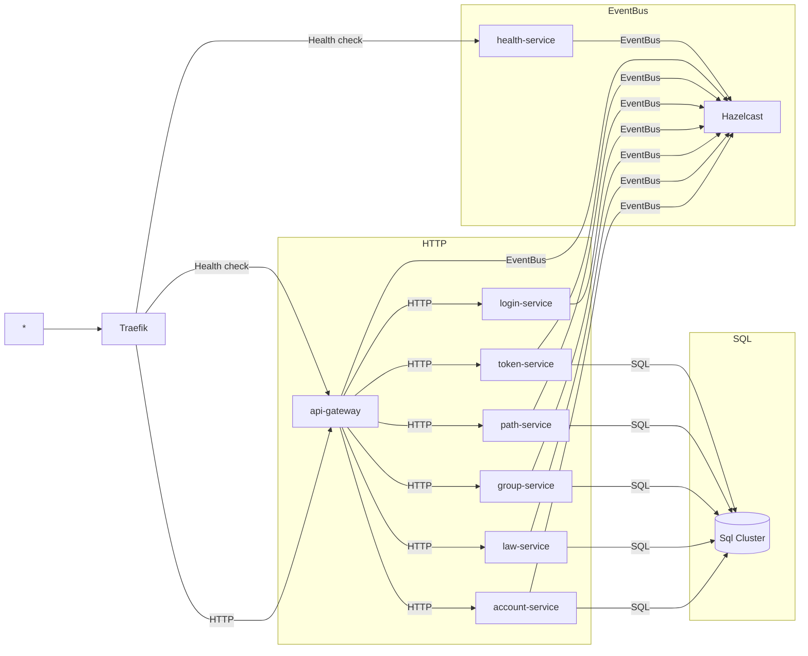

## 🦉 Noukeo

  

[**Noukeo**][website] is an open-source project aimed at simplifying the bootstrapping of microservice projects. The project is currently implemented in Java 11 and uses the Vert.x 4.0.0 library. The primary goal of [**Noukeo**][website] is to provide a streamlined, efficient development process for microservices, allowing developers to quickly create and deploy new services with minimal overhead.

[**Noukeo**][website] relies on Hazelcast for communication between different services, leveraging its powerful distributed computing capabilities to enable efficient, reliable communication between different components of the microservice architecture. Hazelcast also provides high-performance data storage and retrieval, making it an ideal choice for use in a microservice environment.

Overall, [**Noukeo**][website] represents a powerful tool for developers looking to create and deploy microservices quickly and efficiently. With its intuitive, streamlined interface and powerful underlying technology, [**Noukeo**][website] is an ideal choice for any organization looking to take advantage of the benefits of microservice architecture.

[**Noukeo**][website] can be used with the [crustil][] tool.

[crustil]: https://github.com/crustil/crustil

[website]: https://noukeo.provider.ooo

[api-gateway]: https://github.com/noukeo/nk-api-gateway